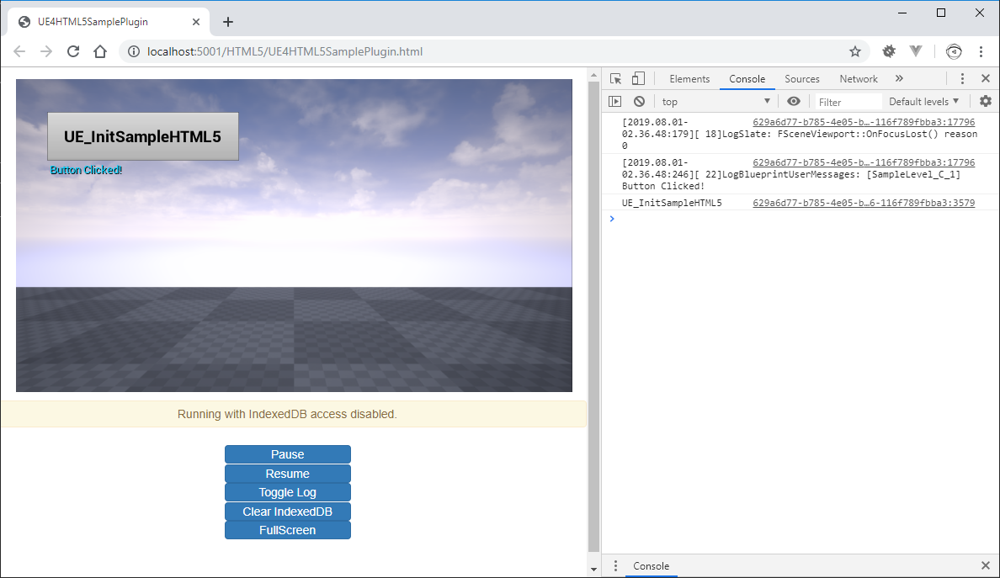

# UE4 HTML5 Sample Plugin

This repository holds an example UE4 project created in 4.22.

The intent of this project is to include custom HTML5 (provided from a UE4 Plugin) and invoke JS methods from a button widget.

## See Also

* [UE4HTML5SampleSource](https://github.com/tgraupmann/UE4HTML5SampleSource) - Include HTML5 from game source

* [UE4HTML5SamplePlugin](https://github.com/tgraupmann/UE4HTML5SamplePlugin) - Include HTML5 from a UE4 plugin

## Support

Support is available on Discord, you can reach me at `Tim Graupmann#0611`.
